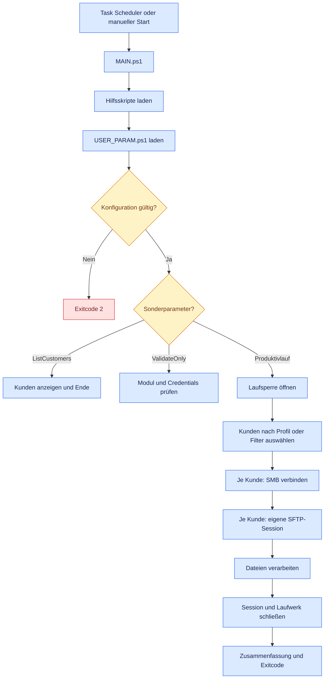
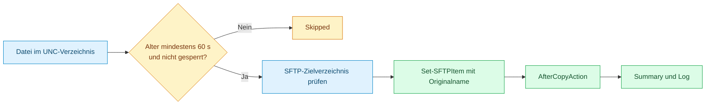

# 01 – Architektur und Ablauf

[Zurück zur Übersicht](README.md)

## 1. Ziel der Lösung

Die Lösung fasst die früher getrennten Main- und Parameterdateien in eine
einheitliche Verarbeitung zusammen:

- eine `MAIN.ps1` als einziger Einstiegspunkt;
- eine `USER_PARAM.ps1` für allgemeine Einstellungen und alle Kunden;
- Auswahl der Ausführung über `-RunProfile` oder `-Customer`;
- Pagero-Sonderlogik ausschließlich im Modus `PAGERO_XML_RENAME`;
- unveränderte Standardübertragung für SCHLANSER, GALAXUS und BRACK;
- definierte Rückgabecodes für den Windows Task Scheduler;
- Sperre gegen parallel laufende Instanzen;
- getrennte SMB- und SFTP-Verbindungen je Kunde.

## 2. Gesamtarchitektur


### 2.1 Logische Schichten

| Schicht | Datei/Komponente | Verantwortung |
| --- | --- | --- |
| Zeitsteuerung | Windows Task Scheduler | Startet `MAIN.ps1` stündlich oder täglich |
| Orchestrierung | `MAIN.ps1` | Lädt Module, validiert, wählt Kunden, steuert Cleanup und Rückgabecode |
| Konfiguration | `USER_PARAM.ps1` | Enthält Profile, Verbindungsdaten, Pfade, Filter und Pagero-Mapping |
| Validierung | `Configuration.ps1` | Prüft Pflichtfelder, Wertebereiche und Pagero-Isolation |
| Credentials | `Cred.ps1` | Liest DPAPI-geschützte Kennwortdateien und erstellt `PSCredential` |
| Quellzugriff | `NetworkDrive.ps1` | Bindet den kundenspezifischen UNC-Pfad als temporäres PSDrive ein |
| Dateiprüfung | `Utils.ps1` | Log, Lauf-Sperre, Pfadbildung und Readiness-Prüfung |
| Pagero-Regel | `PageroXml.ps1` | Liest Verkäufer, ermittelt Entity und bildet den Zielnamen |
| Transfer | `SftpTransfer.ps1` | Öffnet Session, prüft Ziel, lädt hoch, benennt Pagero remote um und schließt Session |
| Nachweis | `Log\transfer.log` | Zeitlicher Ablauf, Warnungen und Fehler pro Kunde |

## 3. Steuerungsfluss eines Programmlaufs



## 4. Kundenauswahl und Priorität

Die Kundenauswahl geschieht in `Get-SelectedCustomers`.

| Aufruf | Auswahlregel | Ausgewählte Kunden |
| --- | --- | --- |
| kein Parameter | Standardwert `HOURLY` | PAGERO |
| `-RunProfile HOURLY` | alle aktivierten Kunden mit Profil `HOURLY` | PAGERO |
| `-RunProfile DAILY` | alle aktivierten Kunden mit Profil `DAILY` | SCHLANSER, GALAXUS, BRACK |
| `-RunProfile ALL` | alle aktivierten Kunden | alle vier Kunden |
| `-Customer PAGERO` | Kundenfilter überschreibt `RunProfile` | nur PAGERO |
| `-Customer "SCHLANSER,BRACK"` | explizite Liste überschreibt `RunProfile` | SCHLANSER und BRACK |

Unbekannte oder deaktivierte Kunden führen zu einem Konfigurationsfehler und
Exitcode `2`. Die Schreibweise der Kunden-ID ist nicht case-sensitiv.

## 5. Standardtransfer

Der Modus `STANDARD` gilt für SCHLANSER, GALAXUS und BRACK.



Wichtige Eigenschaft: Der Remote-Dateiname wird nicht verändert. `-Force`
erlaubt das Überschreiben eines gleichnamigen Remote-Ziels. Nach erfolgreichem
Upload ersetzt die lokale Aktion `RENAME_EXT` die Dateierweiterung durch
`.done`, zum Beispiel `Export.csv` → `Export.done`.

## 6. Pagero-Sondertransfer

Pagero erhält vor dem Upload einen Rename-Plan. Der Verkäufername wird aus dem
XML gelesen und über `SellerEntityMapping` einer Entity zugeordnet.


Beispiel:

```text
Quelle:      2026600172.xml
Verkäufer:   Dometic Benelux B.V.
Mapping:     Dometic Benelux B.V. -> DE13
SFTP-Ziel:   /in/DE13-Invoice-2026600172-<yyyyMMddHHmmssfff>.xml
```

Der Upload erfolgt technisch zuerst mit dem Originalnamen in `/in`; direkt
danach wird die Remote-Datei mit `Move-SFTPItem` auf den endgültigen Namen
verschoben. Wenn der endgültige Zielname bereits existiert, wird nicht erneut
hochgeladen. Nach erfolgreichem Remote-Rename oder bestätigtem `AlreadyExists`
wird die lokale XML-Datei von `.xml` auf `.done` umbenannt.

### 6.1 Lokale Kennzeichnung als verarbeitet

Alle aktivierten Kunden müssen laut Konfigurationsprüfung folgende Werte
verwenden:

```powershell
AfterCopyAction       = 'RENAME_EXT'
AfterCopyNewExtension = '.done'
```

Die ursprüngliche Erweiterung wird ersetzt:

```text
2026600172.xml -> 2026600172.done
Export.csv     -> Export.done
```

Da die aktiven Filter weiterhin `.xml` beziehungsweise `.csv` verlangen,
werden `.done`-Dateien in späteren Läufen nicht erneut ausgewählt. Ein schon
vorhandenes `.done`-Ziel wird nicht überschrieben; der lokale Nachbearbeitungsschritt
und damit der Kundenlauf werden als Fehler protokolliert.

## 7. Schutzmechanismen

### 7.1 Lauf-Sperre

`Enter-TransferLock` öffnet `D:\TREND_SFTP\Log\transfer.lock` exklusiv. Eine
zweite Instanz kann die Datei nicht gleichzeitig öffnen und endet mit Exitcode
`2`. Die Datei darf nach einem Lauf vorhanden bleiben; entscheidend ist der
exklusive Dateihandle, nicht die Existenz der Datei.

### 7.2 Getrennte Verbindungen je Kunde

Für jeden Kunden werden nacheinander ein Quelllaufwerk und eine eigene
SFTP-Session aufgebaut. Der `finally`-Block versucht beide Ressourcen auch bei
einem Fehler zu schließen. Dadurch kann die Session eines vorherigen Kunden
nicht versehentlich für den nächsten Kunden verwendet werden.

### 7.3 Dateibereitschaft

Eine Datei wird nur verarbeitet, wenn:

- ihr Änderungszeitpunkt mindestens `MinimumFileAgeSeconds` zurückliegt;
- sie exklusiv zum Lesen geöffnet werden kann;
- Dateiname und Erweiterung dem Kundenfilter entsprechen.

Zu junge oder gesperrte Dateien zählen als `Skipped`, nicht als Fehler.

### 7.4 XML-Sicherheit

Beim Pagero-Parsing sind DTD-Verarbeitung und externer XML-Resolver deaktiviert.
Damit werden externe Entitäten nicht aufgelöst. Fehlerhaftes XML, ein fehlender
Verkäufername oder ein unbekanntes Mapping führen zu einem Dateifehler.

### 7.5 Cleanup

Der Ablauf verwendet zwei Ebenen von `finally`:

1. pro Kunde zum Schließen der SFTP-Session und Entfernen des PSDrive;
2. global zum Freigeben der Lauf-Sperre.

## 8. Zähler und Status

| Feld | Bedeutung |
| --- | --- |
| `Uploaded` | Datei erfolgreich hochgeladen; bei Pagero inklusive Remote-Umbenennung |
| `AlreadyExists` | Pagero-Zielname existierte bereits; Upload wurde ausgelassen |
| `Skipped` | Datei zu neu oder exklusiv gesperrt |
| `Failed` | Fehler bei einer Datei oder auf Kundenebene |
| `Status` | `OK`, wenn `Failed = 0`; sonst `FAILED` |

Ein erfolgreicher Remote-Transfer mit anschließend fehlgeschlagener lokaler
`.done`-Umbenennung kann gleichzeitig `Uploaded = 1` und `Failed = 1` ergeben.
Der Status ist dann `FAILED`, weil die Quelldatei noch im aktiven Eingabemuster
liegt und beim nächsten Lauf erneut geprüft werden muss.

## 9. Rückgabecodes

| Exitcode | Technische Bedeutung | Scheduler-Bewertung |
| --- | --- | --- |
| `0` | Lauf erfolgreich; `Skipped` oder `AlreadyExists` sind möglich | Erfolg |
| `1` | mindestens ein Kunden- oder Dateifehler; dazu können Credential- oder Verbindungsfehler während eines produktiven Kundenlaufs gehören | fachlich/technisch fehlgeschlagen |
| `2` | Initialisierung, Konfiguration, Modul, Sperre oder Credential-Prüfung bei `-ValidateOnly` fehlgeschlagen | Lauf konnte nicht ordnungsgemäß beginnen |
