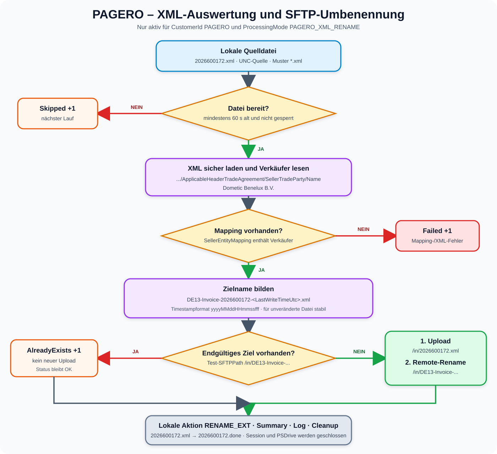

# 04 – Pagero-XML-Verarbeitung

[Zurück zur Übersicht](README.md)

## 1. Geltungsbereich

Die Sonderverarbeitung ist technisch an beide Bedingungen gebunden:

```text
CustomerId     = PAGERO
ProcessingMode = PAGERO_XML_RENAME
```

`Configuration.ps1` verhindert, dass `PAGERO_XML_RENAME` einem anderen Kunden
zugeordnet wird. Umgekehrt muss PAGERO diesen Modus verwenden. Damit bleiben
SCHLANSER, GALAXUS und BRACK von XML-Auswertung und Umbenennung unberührt.

## 2. Fachliche Regel

Aus dem Verkäufernamen in der XML-Datei wird über ein Mapping die Pagero-Entity
ermittelt. Aus Entity, lokalem Dateinamen und Zeitstempel entsteht der endgültige
SFTP-Dateiname.

```text
Dometic Benelux B.V. -> DE13
```

```text
2026600172.xml
    ↓
DE13-Invoice-2026600172-<yyyyMMddHHmmssfff>.xml
```



## 3. Gelesener XML-Pfad

Das Skript sucht folgenden fachlichen Pfad:

```xml
<rsm:CrossIndustryInvoice>
  <rsm:SupplyChainTradeTransaction>
    <ram:ApplicableHeaderTradeAgreement>
      <ram:SellerTradeParty>
        <ram:Name>Dometic Benelux B.V.</ram:Name>
      </ram:SellerTradeParty>
    </ram:ApplicableHeaderTradeAgreement>
  </rsm:SupplyChainTradeTransaction>
</rsm:CrossIndustryInvoice>
```

Intern verwendet `PageroXml.ps1` für jedes Element `local-name()`. Dadurch ist
die Logik nicht vom konkreten Namespace-Präfix `rsm` oder `ram` abhängig. Die
hierarchische Struktur muss jedoch übereinstimmen.

Der Rechnungswert `<ram:ID>` wird für den Dateinamen nicht verwendet. Die
Rechnungsnummer stammt aus dem Basisnamen der lokalen Datei:

```powershell
$invoiceNumber = [System.IO.Path]::GetFileNameWithoutExtension($LocalFile.Name)
```

Damit wird `2026600172.xml` zur Rechnungsnummer `2026600172`.

## 4. XML-Sicherheitskonfiguration

Die XML-Datei wird mit folgenden Einstellungen geladen:

```powershell
$xmlSettings.DtdProcessing = [System.Xml.DtdProcessing]::Prohibit
$xmlSettings.XmlResolver = $null
```

Auswirkungen:

- DTDs werden abgelehnt;
- externe XML-Ressourcen werden nicht aufgelöst;
- ungültiges XML führt zu einem kontrollierten Dateifehler;
- der XML-Inhalt wird nicht verändert; `PreserveWhitespace = $true` erhält die
  ursprüngliche Formatierung. Nach erfolgreicher Verarbeitung ändert sich nur
  die lokale Dateierweiterung auf `.done`.

## 5. Mapping

Das Mapping befindet sich im PAGERO-Block der `USER_PARAM.ps1`:

```powershell
SellerEntityMapping = @{
    'Dometic Benelux B.V.' = 'DE13'
}
```

Beim Lesen wird der Text mit `.Trim()` bereinigt. Normale PowerShell-Hashtables
sind standardmäßig nicht case-sensitiv. Führende oder nachgestellte Leerzeichen
werden entfernt; unterschiedliche Interpunktion oder ein fachlich abweichender
Name benötigen jedoch einen eigenen Mapping-Eintrag.

### 5.1 Mapping sicher ergänzen

```powershell
SellerEntityMapping = @{
    'Dometic Benelux B.V.' = 'DE13'
    # 'Fachlich bestätigter Verkäufername' = 'BESTAETIGTE_ENTITY'
}
```

Zulässige Entity-Zeichen:

```text
A-Z, a-z, 0-9, Unterstrich (_), Bindestrich (-)
```

Ungültige Beispiele sind `DE/13`, `DE 13` oder `DE13:NL`, weil sie nicht der
Prüfung `^[A-Za-z0-9_-]+$` entsprechen.

## 6. Bildung des Zielnamens

Formel:

```text
<Entity>-Invoice-<lokaler Basisname>-<LastWriteTimeUtc>.xml
```

Timestamp-Format:

```text
yyyyMMddHHmmssfff
```

| Bestandteil | Beispiel | Herkunft |
| --- | --- | --- |
| Entity | `DE13` | `SellerEntityMapping` |
| fester Text | `Invoice` | Skriptregel |
| Rechnungsnummer | `2026600172` | lokaler Dateiname ohne `.xml` |
| Timestamp | `20260903081024123` | `LastWriteTimeUtc`, inklusive Millisekunden |
| Erweiterung | `.xml` | Skriptregel |

Vollständiges Beispiel:

```text
DE13-Invoice-2026600172-20260903081024123.xml
```

Der gezeigte Timestamp ist ein Formatbeispiel. Der tatsächliche Wert hängt vom
UTC-Änderungszeitpunkt der Quelldatei auf der Freigabe ab.

## 7. Warum LastWriteTimeUtc verwendet wird

`Get-Date` bei jedem Lauf würde bei jedem Wiederholungsversuch einen neuen
Namen erzeugen. Stattdessen nutzt das Skript den unveränderten UTC-Zeitstempel
der Quelldatei.

Folge:

| Situation | Zielname |
| --- | --- |
| unveränderte `.xml`-Quelldatei erneut verarbeitet, beispielsweise nach fehlgeschlagener lokaler Umbenennung | identisch |
| erfolgreich verarbeitete Datei trägt bereits `.done` | wird vom `*.xml`-Filter nicht ausgewählt |
| identische Datei mit erhaltenem UTC-Zeitstempel erneut bereitgestellt | identisch; Remote-Ziel wird als `AlreadyExists` erkannt |
| Dateiinhalt aktualisiert und Änderungszeitpunkt geändert | neuer Timestamp und neuer Zielname |
| Datei kopiert und dabei Zeitstempel beibehalten | identisch |
| Datei kopiert und Zeitstempel neu gesetzt | neuer Zielname |

Das Verfahren ist für unveränderte Quelldateien idempotent. Es ist keine
inhaltliche Hash-Prüfung: Ändert jemand den Inhalt, ohne den Zeitstempel zu
ändern, bleibt der Zielname gleich.

## 8. Remote-Ablauf

Für `2026600172.xml` und das Ziel `/in` wird folgender Plan erzeugt:

```text
RemoteSourcePath = /in/2026600172.xml
RemoteTargetPath = /in/DE13-Invoice-2026600172-<Timestamp>.xml
```

Ablauf:

1. Das Remote-Verzeichnis `/in` wird geprüft.
2. Der endgültige Zielpfad wird auf Existenz geprüft.
3. Existiert er, wird der Upload ausgelassen und `AlreadyExists` erhöht.
4. Andernfalls wird lokal `2026600172.xml` nach `/in` hochgeladen.
5. Danach wird die Remote-Datei mit `Move-SFTPItem` auf den endgültigen Namen
   verschoben.
6. Erst nach erfolgreichem Upload und Rename wird `Uploaded` erhöht.

Zwischen Schritt 4 und 5 kann der Originalname kurzzeitig auf dem SFTP-Server
sichtbar sein. Scheitert die Umbenennung, wird die Datei als Fehler protokolliert.
Beim nächsten Lauf wird der Originalname mit `-Force` erneut hochgeladen und die
Umbenennung erneut versucht.

## 9. Lokale `.done`-Kennzeichnung

Aktuelle Konfiguration:

```powershell
AfterCopyAction       = 'RENAME_EXT'
AfterCopyNewExtension = '.done'
```

Nach erfolgreichem Upload und Remote-Rename ersetzt das Skript die lokale
Erweiterung:

```text
2026600172.xml -> 2026600172.done
```

Damit fällt die Datei aus dem aktiven Pagero-Filter `*.xml` heraus. Wenn der
deterministische endgültige Remote-Zielname bereits existiert, gilt die Datei
ebenfalls als abgearbeitet und wird lokal auf `.done` umbenannt.

Existiert `2026600172.done` schon, wird diese Datei nicht überschrieben. Die
lokale Nachbearbeitung meldet einen Fehler. Bei einem zuvor erfolgreichen
Remote-Upload kann die Summary deshalb gleichzeitig `Uploaded = 1` und
`Failed = 1` enthalten.

## 10. Pagero-Test ohne SFTP

```powershell
Set-Location 'D:\TREND_SFTP'

.\TEST_PAGERO_XML.ps1 `
    -XmlPath 'D:\Temp\2026600172.xml'
```

Erwartete Felder:

```text
SellerName       : Dometic Benelux B.V.
Entity           : DE13
OriginalFileName : 2026600172.xml
NewFileName      : DE13-Invoice-2026600172-<Timestamp>.xml
RemoteSourcePath : /in/2026600172.xml
RemoteTargetPath : /in/DE13-Invoice-2026600172-<Timestamp>.xml
```

Dieser Test öffnet keine SMB- oder SFTP-Verbindung. Er benötigt lediglich eine
lokale XML-Testdatei und die lokale `USER_PARAM.ps1`.

Die lokale `.done`-Umbenennung wird separat ohne SFTP getestet:

```powershell
.\TEST_AFTER_COPY.ps1
```

Der Test erzeugt ausschließlich temporäre Dateien, prüft `invoice.xml` →
`invoice.done` sowie den Schutz vor Überschreiben einer vorhandenen `.done`-Datei
und räumt die Testdateien anschließend auf.

## 11. Erwartete Fehlerfälle

| Fehler | Meldungsinhalt | Wirkung |
| --- | --- | --- |
| falsche Erweiterung | `supports XML files only` | Datei fehlgeschlagen |
| ungültiges XML | XML-Parsermeldung | Datei fehlgeschlagen |
| Name fehlt | `SellerTradeParty/Name not found` | Datei fehlgeschlagen |
| Verkäufer unbekannt | `No Pagero entity mapping exists` | Datei fehlgeschlagen |
| Entity enthält Sonderzeichen | `contains unsupported filename characters` | Datei fehlgeschlagen |
| `/in` fehlt | `Remote directory ... does not exist` | Kunde fehlgeschlagen |
| Ziel existiert bereits | `target already exists` | kein Fehler; `AlreadyExists +1` |
| Datei jünger als 60 Sekunden | `too new or locked` | kein Fehler; `Skipped +1` |
| lokale `.done`-Datei existiert | `Local post-transfer target already exists` | lokale Nachbearbeitung fehlgeschlagen; `Failed +1` |

## 12. Abnahmekriterien

Die Pagero-Verarbeitung gilt als fachlich abgenommen, wenn:

- die Beispiel-XML den Verkäufer `Dometic Benelux B.V.` als `DE13` erkennt;
- der Basisname `2026600172` aus dem Dateinamen übernommen wird;
- der endgültige Name exakt dem vereinbarten Schema entspricht;
- die Datei unter `/in` mit dem endgültigen Namen vorhanden ist;
- ein zweiter Lauf kein Duplikat erzeugt und `AlreadyExists` meldet;
- die Quelldatei nach erfolgreicher Verarbeitung lokal als `2026600172.done`
  vorliegt und nicht mehr als `*.xml` ausgewählt wird;
- eine vorhandene `.done`-Datei nicht überschrieben wird;
- DAILY-Transfers weiterhin ihre Originalnamen verwenden.
