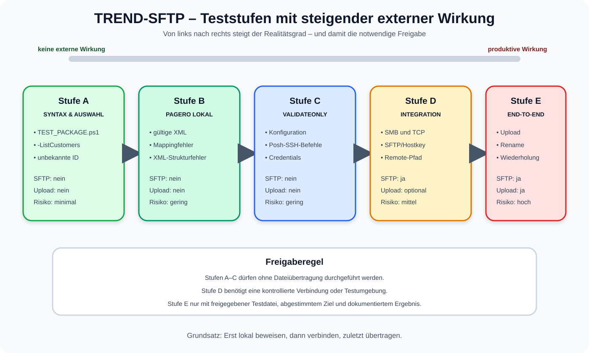

# 05 – Testszenarien

[Zurück zur Übersicht](README.md)

## 1. Teststrategie

Die Tests sind nach externer Wirkung gestaffelt. Zuerst werden Syntax und lokale
Logik geprüft, danach Konfiguration und Credentials, zuletzt Verbindungen und
produktive Dateiübertragung.



| Stufe | Farbe | SFTP-Verbindung | Dateiübertragung | Einsatz |
| --- | --- | :---: | :---: | --- |
| A – Syntax und Auswahl | 🟢 | nein | nein | jederzeit |
| B – lokale Pagero-Logik | 🟢 | nein | nein | jederzeit mit Testkopie |
| C – Konfiguration/Credentials | 🔵 | nein | nein | nach Deployment/Passwortwechsel |
| D – Verbindung/Integration | 🟡 | ja | teilweise | Wartungsfenster/Testsystem |
| E – End-to-End | 🔴 | ja | ja | kontrollierte Abnahme |

> [!CAUTION]
> Alle Befehle ohne `-ValidateOnly`, `-ListCustomers` oder ein spezielles
> Testskript können produktive Dateien übertragen. Negative Tests niemals durch
> absichtliche Änderung der produktiven Credentials oder produktiven XML-Dateien
> durchführen. Dafür eine Paketkopie und Testverzeichnisse verwenden.

## 2. Testvorbereitung

```powershell
$testRoot = 'D:\Temp\TREND_SFTP_TEST'
New-Item -ItemType Directory -Path $testRoot -Force | Out-Null

Copy-Item `
    -LiteralPath 'D:\TREND_SFTP' `
    -Destination $testRoot `
    -Recurse

Set-Location "$testRoot\TREND_SFTP"
```

Sensible `.sec`-Dateien in der Testkopie nur verwenden, wenn der Speicherort
gleichwertig geschützt ist. Für reine XML-Tests werden sie nicht benötigt.

## 3. Testübersicht

| ID | Szenario | Typ | Erwartung |
| --- | --- | --- | --- |
| T01 | Paketprüfung | lokal | Syntax, Konfiguration und `.done`-Verhalten erfolgreich |
| T02 | Kundenliste | lokal | vier konfigurierte Kunden sichtbar |
| T03 | HOURLY-Validierung | lokal/Credential | PAGERO-Credentials lesbar |
| T04 | DAILY-Validierung | lokal/Credential | drei Standardkunden-Credentials lesbar |
| T05 | Kundenfilter überschreibt Profil | lokal | nur gewünschter Kunde ausgewählt |
| T06 | `.done`-Umbenennung | lokal | Erweiterung ersetzt; vorhandenes Ziel geschützt |
| T10 | gültige Pagero-XML | lokal | Seller `Dometic Benelux B.V.`, Entity `DE13` |
| T11 | unbekannter Verkäufer | negativ/lokal | kontrollierter Mapping-Fehler |
| T12 | Verkäufername fehlt | negativ/lokal | kontrollierter Pfadfehler |
| T13 | ungültiges XML | negativ/lokal | XML-Parserfehler |
| T14 | falsche Dateierweiterung | negativ/lokal | XML-only-Fehler |
| T20 | Datei zu jung | Integration | `Skipped +1` |
| T21 | Datei exklusiv gesperrt | Integration | `Skipped +1` |
| T22 | paralleler Lauf | lokal | zweite Instanz Exitcode 2 |
| T30 | SFTP-Ziel existiert | Integration | Session und Verzeichnisprüfung erfolgreich |
| T31 | SFTP-Ziel fehlt | negativ/Integration | Kundenfehler, Exitcode 1 |
| T32 | unbekannter Hostkey | negativ/Integration | kontrollierter Verbindungsfehler |
| T40 | Pagero End-to-End | produktiv/Test-SFTP | Upload und Remote-Rename erfolgreich |
| T41 | Pagero-Folgelauf | produktiv/Test-SFTP | `.done` wird nicht erneut ausgewählt |
| T41b | identische Pagero-Wiederanlieferung | produktiv/Test-SFTP | `AlreadyExists +1`, danach erneut `.done` |
| T42 | DAILY-Namensprüfung | produktiv/Test-SFTP | Remote-CSV unverändert, lokale Datei `.done` |
| T43 | Fehlerisolation | produktiv/Test-SFTP | nachfolgender Kunde läuft weiter |

## 4. Stufe A – Syntax und Auswahl

### T01 – Paketprüfung

```powershell
Set-Location 'D:\TREND_SFTP'
.\TEST_PACKAGE.ps1
$LASTEXITCODE
```

Erwartung:

- für jede `.ps1`-Datei `OK`;
- Konfigurationsmeldung `OK: configuration and .done business rule`;
- lokaler Verhaltenstest für `.done` und Kollisionsschutz erfolgreich;
- Abschluss `All PowerShell files and local behavior tests passed.`;
- Exitcode `0`.

Bei einem Parserfehler zeigt das Testskript Datei, Zeile und Meldung an.

### T06 – Lokale `.done`-Umbenennung

Der Test wird bereits von `TEST_PACKAGE.ps1` aufgerufen, kann aber auch einzeln
gestartet werden:

```powershell
.\TEST_AFTER_COPY.ps1
$LASTEXITCODE
```

Erwartung:

- eine temporäre `invoice.xml` wird zu `invoice.done`;
- eine vorhandene `invoice.done` wird nicht überschrieben;
- alle temporären Testdateien werden entfernt;
- Exitcode `0`.

### T02 – Kundenliste

```powershell
.\MAIN.ps1 -ListCustomers
```

Erwartete Zuordnung:

| CustomerId | Enabled | RunProfile | ProcessingMode |
| --- | --- | --- | --- |
| PAGERO | True | HOURLY | PAGERO_XML_RENAME |
| SCHLANSER | True | DAILY | STANDARD |
| GALAXUS | True | DAILY | STANDARD |
| BRACK | True | DAILY | STANDARD |

Es darf keine SMB- oder SFTP-Verbindung aufgebaut werden.

### T05 – Kundenfilter und Fehlerprüfung

Sicherer Test mit Credential-Validierung:

```powershell
.\MAIN.ps1 -RunProfile DAILY -Customer PAGERO -ValidateOnly
```

Erwartung: Trotz `RunProfile DAILY` wird nur PAGERO angezeigt, weil
`-Customer` Vorrang hat.

Unbekannte ID:

```powershell
.\MAIN.ps1 -Customer NICHT_VORHANDEN -ValidateOnly
$LASTEXITCODE
```

Erwartung: `Unknown CustomerId`, Exitcode `2`.

## 5. Stufe B – lokale Pagero-Tests

### T10 – Gültige XML mit bekanntem Verkäufer

```powershell
.\TEST_PAGERO_XML.ps1 -XmlPath 'D:\Temp\2026600172.xml'
```

Erwartung:

- `SellerName = Dometic Benelux B.V.`;
- `Entity = DE13`;
- `OriginalFileName = 2026600172.xml`;
- `NewFileName` beginnt mit `DE13-Invoice-2026600172-`;
- `RemoteTargetPath` beginnt mit `/in/DE13-Invoice-2026600172-`.

Optionales automatisches Prüfmuster:

```powershell
$output = & .\TEST_PAGERO_XML.ps1 -XmlPath 'D:\Temp\2026600172.xml' | Out-String

if ($output -notmatch 'Dometic Benelux B\.V\.') { throw 'Seller fehlt.' }
if ($output -notmatch 'DE13-Invoice-2026600172-\d{17}\.xml') { throw 'Zielname falsch.' }

Write-Host 'Pagero-Test erfolgreich.' -ForegroundColor Green
```

### T11 – Unbekannter Verkäufer

Nur mit einer Testkopie arbeiten:

```powershell
$source = 'D:\Temp\2026600172.xml'
$target = 'D:\Temp\2026600172_unknown-seller.xml'

$xmlText = Get-Content -LiteralPath $source -Raw
$xmlText = $xmlText.Replace(
    '<ram:Name>Dometic Benelux B.V.</ram:Name>',
    '<ram:Name>Unbekannter Testverkaeufer</ram:Name>'
)
$xmlText | Set-Content -LiteralPath $target -Encoding UTF8

.\TEST_PAGERO_XML.ps1 -XmlPath $target
```

Erwartung: Abbruch mit `No Pagero entity mapping exists`. Es wird keine Datei
übertragen.

### T12 – Verkäufername fehlt

Testkopie erzeugen und ausschließlich das Element im Verkäuferblock entfernen.
Am sichersten die XML strukturell bearbeiten:

```powershell
$source = 'D:\Temp\2026600172.xml'
$target = 'D:\Temp\2026600172_missing-seller.xml'

[xml]$doc = Get-Content -LiteralPath $source -Raw
$node = $doc.SelectSingleNode(
    "/*[local-name()='CrossIndustryInvoice']" +
    "/*[local-name()='SupplyChainTradeTransaction']" +
    "/*[local-name()='ApplicableHeaderTradeAgreement']" +
    "/*[local-name()='SellerTradeParty']" +
    "/*[local-name()='Name']"
)

[void]$node.ParentNode.RemoveChild($node)
$doc.Save($target)

.\TEST_PAGERO_XML.ps1 -XmlPath $target
```

Erwartung: `SellerTradeParty/Name not found`.

### T13 – Ungültiges XML

```powershell
'<rsm:CrossIndustryInvoice><ungeschlossen>' |
    Set-Content 'D:\Temp\invalid.xml' -Encoding UTF8

.\TEST_PAGERO_XML.ps1 -XmlPath 'D:\Temp\invalid.xml'
```

Erwartung: kontrollierter XML-Parserfehler.

### T14 – Falsche Erweiterung

```powershell
Copy-Item 'D:\Temp\2026600172.xml' 'D:\Temp\2026600172.txt'
.\TEST_PAGERO_XML.ps1 -XmlPath 'D:\Temp\2026600172.txt'
```

Erwartung: `Pagero processing supports XML files only`.

## 6. Stufe C – Konfiguration und Credentials

### T03 – HOURLY validieren

```powershell
.\MAIN.ps1 -RunProfile HOURLY -ValidateOnly
$LASTEXITCODE
```

Erwartung: `Configuration validation completed successfully`, Anzeige PAGERO,
Exitcode `0`. Geprüft werden `trend.sec` und `pagero2.sec`.

### T04 – DAILY validieren

```powershell
.\MAIN.ps1 -RunProfile DAILY -ValidateOnly
$LASTEXITCODE
```

Erwartung: SCHLANSER, GALAXUS und BRACK werden angezeigt, Exitcode `0`.
Geprüft werden `trend.sec` sowie alle drei SFTP-Credential-Dateien.

### Credential-Negativtest

Nicht in der produktiven Installation durchführen. In der Testkopie den Pfad
eines Testkunden auf eine nicht vorhandene Datei setzen und `-ValidateOnly`
aufrufen. Erwartung: `Encrypted credential file not found`, Exitcode `2`.

Eine Datei mit fremdem Inhalt muss `cannot be decrypted by the current Windows
account` liefern. Danach die Testkonfiguration wiederherstellen.

## 7. Stufe D – Readiness und Sperren

### T20 – Datei jünger als Mindestalter

Nur in einem dafür vorgesehenen Quell- und SFTP-Testverzeichnis:

```powershell
$file = Get-Item 'D:\TestSource\2026600172.xml'
$file.LastWriteTime = Get-Date
```

Unmittelbar den zugehörigen Integrationslauf starten. Erwartung:

- Meldung `too new or locked`;
- `Skipped = 1`;
- kein Upload dieser Datei;
- Exitcode bleibt `0`, sofern kein anderer Fehler auftritt.

Nach Ablauf von mindestens 60 Sekunden muss die Datei verarbeitbar sein.

### T21 – Datei exklusiv gesperrt

Fenster 1:

```powershell
$path = 'D:\TestSource\2026600172.xml'
$lock = [System.IO.File]::Open(
    $path,
    [System.IO.FileMode]::Open,
    [System.IO.FileAccess]::ReadWrite,
    [System.IO.FileShare]::None
)
```

Fenster 2: Integrationslauf starten. Erwartung: Datei wird als `Skipped`
gezählt. Danach in Fenster 1 unbedingt freigeben:

```powershell
$lock.Dispose()
```

### T22 – Lauf-Sperre

Fenster 1:

```powershell
$lockPath = 'D:\TREND_SFTP\Log\transfer.lock'
$lockDir = Split-Path -Parent $lockPath
New-Item -ItemType Directory -Path $lockDir -Force | Out-Null

$testLock = [System.IO.File]::Open(
    $lockPath,
    [System.IO.FileMode]::OpenOrCreate,
    [System.IO.FileAccess]::ReadWrite,
    [System.IO.FileShare]::None
)
```

Fenster 2:

```powershell
.\MAIN.ps1 -RunProfile HOURLY
$LASTEXITCODE
```

Erwartung: `Another transfer run is already active`, Exitcode `2`, keine
Übertragung. Anschließend in Fenster 1:

```powershell
$testLock.Dispose()
```

## 8. Stufe D – Verbindungstests

### T30 – Erreichbarkeit und gültiges Remote-Verzeichnis

1. `Test-NetConnection <Host> -Port 22` muss erfolgreich sein.
2. `-ValidateOnly` muss erfolgreich sein.
3. Ein kontrollierter Lauf mit leerem Quellverzeichnis darf Session und
   Remote-Verzeichnis prüfen, aber keine Datei hochladen.

Erwartung: Summary mit `Uploaded = 0`, `Failed = 0`, `Status = OK`.

### T31 – Fehlendes Remote-Verzeichnis

Nur in einer Testkopie `RemoteDirectory` auf einen garantiert nicht vorhandenen
Testpfad setzen. Erwartung:

```text
Remote directory '...' does not exist on '...'.
```

Der Kunde erhält `Failed = 1`, der Gesamtlauf Exitcode `1`.

### T32 – Hostkey-Verhalten

Nicht durch Manipulation der produktiven Hostkey-Datei testen. Für einen neuen
Testhost `AcceptNewHostKey = $false` setzen. Erwartung: unbekannter Schlüssel
wird als Fehler abgelehnt. Erst nach Fingerprint-Bestätigung kontrolliert
vertrauen; niemals `-Force` verwenden.

## 9. Stufe E – End-to-End-Abnahme

### T40 – Pagero-Erstübertragung

Voraussetzungen:

- freigegebenes Test-SFTP oder abgestimmtes Wartungsfenster;
- gültige XML mit Verkäufer `Dometic Benelux B.V.`;
- Datei älter als 60 Sekunden und nicht gesperrt;
- endgültiger Zielname noch nicht vorhanden.

Ausführung:

```powershell
.\MAIN.ps1 -Customer PAGERO
$LASTEXITCODE
```

Erwartung:

- `Uploaded = 1`;
- `AlreadyExists = 0`;
- `Failed = 0`;
- Status `OK`, Exitcode `0`;
- Remote-Datei nach Schema `DE13-Invoice-...xml` unter `/in`;
- lokale `2026600172.xml` wurde zu `2026600172.done` umbenannt.

### T41 – Normaler Pagero-Folgelauf

Nach T40 denselben Lauf erneut starten. Da die Quelldatei nun `.done` heißt,
wird sie vom Filter `*.xml` nicht mehr ausgewählt.

Erwartung:

- `Uploaded = 0`;
- `AlreadyExists = 0`;
- kein zweites Remote-Dokument;
- lokale `.done`-Datei bleibt unverändert;
- Exitcode `0`.

### T41b – Identische Pagero-Wiederanlieferung

Dieser Test prüft gezielt den Remote-Dublettenpfad. Nur in einer Testumgebung:

1. vorhandene lokale `.done`-Datei aus dem aktiven Quellverzeichnis in ein
   Archivverzeichnis verschieben;
2. dieselbe XML erneut mit exakt dem ursprünglichen `LastWriteTimeUtc`
   bereitstellen;
3. Pagero erneut starten.

Beispiel zur Wiederherstellung des Zeitstempels:

```powershell
$xml = Get-Item 'D:\TestSource\2026600172.xml'
$xml.LastWriteTimeUtc = [datetime]'2026-09-03T06:10:24.123Z'  # Testwert ersetzen

.\MAIN.ps1 -Customer PAGERO
```

Erwartung:

- endgültiger Remote-Pfad wird als vorhanden erkannt;
- `Uploaded = 0` und `AlreadyExists = 1`;
- kein zweites Remote-Dokument;
- die erneut bereitgestellte XML wird lokal zu `2026600172.done`;
- Exitcode `0`.

### T42 – DAILY-Dateinamen unverändert

Für jeden Standardkunden eine freigegebene Testdatei bereitstellen. Ausführen:

```powershell
.\MAIN.ps1 -RunProfile DAILY
```

Remote prüfen:

- SCHLANSER: identischer lokaler und entfernter Dateiname;
- GALAXUS: identischer Dateiname in `/StockData_EU`;
- BRACK: identischer Dateiname in `/pricelistimport`;
- keine Zeichenfolge `-Invoice-` durch das Skript ergänzt.

Lokal prüfen:

- jede erfolgreich verarbeitete `.csv` wurde zu `.done` umbenannt;
- die ursprüngliche `.csv` ist nicht mehr vorhanden;
- der Inhalt der `.done`-Datei entspricht der Eingabedatei.

### T43 – Fehlerisolation zwischen Kunden

Nur im Testsystem bei einem frühen DAILY-Kunden einen kontrollierten Fehler
konfigurieren und für einen späteren Kunden eine gültige Datei bereitstellen.

Erwartung:

- erster Kunde `FAILED`;
- Session und PSDrive des fehlerhaften Kunden werden geschlossen;
- nachfolgender Kunde wird trotzdem gestartet;
- dessen Upload nutzt seine eigene Session und sein eigenes Remote-Ziel;
- Gesamtexitcode `1` wegen des ersten Fehlers.

## 10. Abnahmeprotokoll

Für jeden Test dokumentieren:

| Feld | Eintrag |
| --- | --- |
| Test-ID | z. B. T40 |
| Datum/Uhrzeit |  |
| ausführendes Windows-Konto |  |
| Server/Umgebung | Produktion / QA |
| Skriptstand/ZIP-Prüfsumme |  |
| Eingabedatei |  |
| erwartetes Ergebnis |  |
| tatsächliches Ergebnis |  |
| Exitcode |  |
| relevante Logzeilen |  |
| Remote-Nachweis | Dateiname/Screenshot |
| Ergebnis | bestanden / nicht bestanden |
| Bearbeiter |  |

## 11. Mindesttestumfang vor Produktivsetzung

- [ ] T01 Syntax erfolgreich
- [ ] T02 Kunden- und Profilzuordnung korrekt
- [ ] T03 HOURLY-Validierung erfolgreich
- [ ] T04 DAILY-Validierung erfolgreich
- [ ] T06 `.done`-Umbenennung und Kollisionsschutz erfolgreich
- [ ] T10 Pagero-Mapping und Name korrekt
- [ ] T11 unbekannter Verkäufer kontrolliert abgelehnt
- [ ] T20 Mindestalter funktioniert
- [ ] T22 Parallelstart wird blockiert
- [ ] T40 Pagero-End-to-End erfolgreich
- [ ] T41 Pagero-Folgelauf ignoriert `.done`
- [ ] T41b identische Pagero-Wiederanlieferung erzeugt kein Duplikat
- [ ] T42 DAILY-Remote-Dateinamen bleiben unverändert und lokale Dateien werden `.done`
- [ ] Scheduler-Konto entspricht Credential-Ersteller
- [ ] Scheduler-Rückgabecode und Log geprüft
