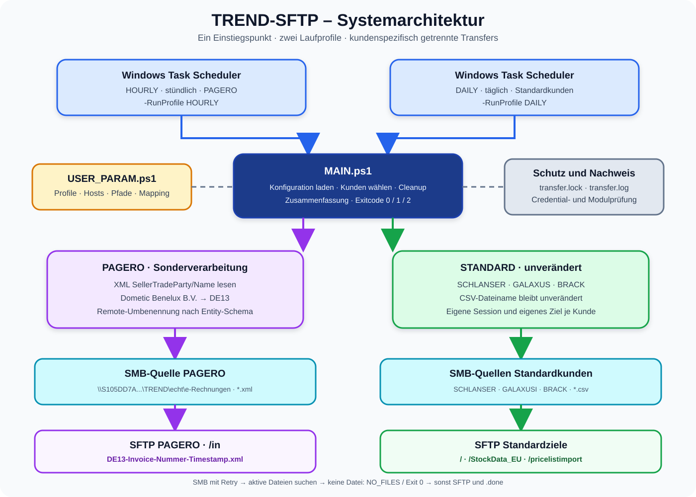

# TREND-SFTP – Dokumentationspaket

**System:** Vereinheitlichter SFTP-Dateitransfer  
**Stand:** 03.09.2026  
**Zielplattform:** Windows PowerShell 5.1  
**Produktivverzeichnis:** `D:\TREND_SFTP`

Dieses Dokumentationspaket beschreibt Installation, Konfiguration, Betrieb,
Pagero-Sonderverarbeitung, Tests und Fehlerbehebung des vereinheitlichten
TREND-SFTP-Pakets. Es gilt für die Skriptversion mit einer zentralen
`MAIN.ps1` und einer zentralen `USER_PARAM.ps1`.

> [!IMPORTANT]
> Nur der Kunde **PAGERO** verwendet die XML-Auswertung und Umbenennung.
> SCHLANSER, GALAXUS und BRACK werden im Modus `STANDARD` übertragen; ihr
> Dateiname bleibt unverändert.



## Dokumentationsübersicht

| Dokument | Inhalt | Zielgruppe |
| --- | --- | --- |
| [01 – Architektur und Ablauf](01_ARCHITEKTUR_UND_ABLAUF.md) | Komponenten, Profile, Datenfluss und Schutzmechanismen | Entwicklung, Betrieb |
| [02 – Installation und Konfiguration](02_INSTALLATION_UND_KONFIGURATION.md) | Voraussetzungen, Deployment, Credentials und alle Parameter | Administration |
| [03 – Aufruf und Scheduler-Betrieb](03_AUFRUF_UND_SCHEDULER.md) | Alle Aufrufvarianten, Scheduler-Konfiguration und Rückgabecodes | Betrieb |
| [04 – Pagero-XML-Verarbeitung](04_PAGERO_XML_VERARBEITUNG.md) | XML-Pfad, Mapping, Dateiname und Wiederholungsverhalten | Entwicklung, Betrieb |
| [05 – Testszenarien](05_TESTSZENARIEN.md) | Syntax-, Konfigurations-, Negativ-, Integrations- und Abnahmetests | Test, Betrieb |
| [06 – Fehlerbehebung](06_FEHLERBEHEBUNG.md) | Fehlerbilder, Ursachen, Prüfungen und Maßnahmen | Betrieb, Support |
| [07 – Betriebshandbuch](07_BETRIEBSHANDBUCH_CHECKLISTEN.md) | Checklisten, Änderungen, Credential- und Hostkey-Wechsel | Betrieb |
| [Schnellreferenz](SCHNELLREFERENZ.md) | Häufigste Befehle auf einer Seite | Betrieb |

## Aktuelle Kunden- und Profilzuordnung

| Kunde | Profil | Verarbeitungsmodus | SFTP-Ziel | Zielname |
| --- | --- | --- | --- | --- |
| PAGERO | `HOURLY` | `PAGERO_XML_RENAME` | `/in` | `Entity-Invoice-Nummer-Timestamp.xml` |
| SCHLANSER | `DAILY` | `STANDARD` | `/` | unverändert |
| GALAXUS | `DAILY` | `STANDARD` | `/StockData_EU` | unverändert |
| BRACK | `DAILY` | `STANDARD` | `/pricelistimport` | unverändert |

## Schnellstart nach dem Deployment

PowerShell mit dem Windows-Konto öffnen, unter dem später die geplanten Tasks
laufen. Danach:

```powershell
Set-Location 'D:\TREND_SFTP'

# 1. Syntax aller PowerShell-Dateien prüfen
.\TEST_PACKAGE.ps1

# 2. Konfiguration, Modul und Credentials prüfen – ohne SFTP-Verbindung
.\MAIN.ps1 -RunProfile HOURLY -ValidateOnly
.\MAIN.ps1 -RunProfile DAILY  -ValidateOnly

# 3. Konfigurierte Kunden anzeigen – ohne Verbindung
.\MAIN.ps1 -ListCustomers

# 4. Produktiver Lauf
.\MAIN.ps1 -RunProfile HOURLY
.\MAIN.ps1 -RunProfile DAILY
```

## Ampellogik dieser Dokumentation

| Kennzeichnung | Bedeutung |
| --- | --- |
| 🟢 | sicherer Test ohne Dateiübertragung oder erfolgreicher Zustand |
| 🔵 | normale Steuerung oder Information |
| 🟡 | kontrollierter Integrationstest beziehungsweise Prüfpunkt |
| 🔴 | produktive Auswirkung, Fehler oder sicherheitsrelevante Maßnahme |
| 🟣 | Pagero-spezifische Verarbeitung |

## Wichtigste Betriebsregeln

1. Die geplanten Tasks und die Erzeugung der `.sec`-Dateien müssen unter
   demselben Windows-Konto und auf demselben Server erfolgen.
2. Vor Änderungen immer zuerst `USER_PARAM.ps1`, Skripte, Logdatei und die
   Posh-SSH-Hostkey-Datei sichern. `.sec`-Dateien niemals in Tickets oder
   E-Mails versenden.
3. `-ValidateOnly` führt keine Netzwerk- oder SFTP-Verbindung aus, entschlüsselt
   aber die benötigten Credentials.
4. Ein manueller Produktivlauf kann Dateien übertragen. Vorher immer Profil,
   Kundenfilter und Quellverzeichnis prüfen.
5. Der Pagero-Zielname ist für eine unveränderte Quelldatei stabil. Ein bereits
   vorhandenes Ziel wird als `AlreadyExists` gezählt und nicht erneut hochgeladen.
6. Nach erfolgreicher Verarbeitung wird die lokale Eingabedatei bei jedem Kunden
   auf `.done` umbenannt. Ein vorhandenes `.done`-Ziel wird nicht überschrieben.

## Paketstruktur

```text
TREND_SFTP_DOKUMENTATION\
├── README.md
├── 01_ARCHITEKTUR_UND_ABLAUF.md
├── 02_INSTALLATION_UND_KONFIGURATION.md
├── 03_AUFRUF_UND_SCHEDULER.md
├── 04_PAGERO_XML_VERARBEITUNG.md
├── 05_TESTSZENARIEN.md
├── 06_FEHLERBEHEBUNG.md
├── 07_BETRIEBSHANDBUCH_CHECKLISTEN.md
├── SCHNELLREFERENZ.md
├── MANIFEST.sha256
└── grafiken\
    ├── 01_systemarchitektur.svg
    ├── 02_pagero_ablauf.svg
    └── 03_teststufen.svg
```

## Technische Referenzen

- [Posh-SSH in der PowerShell Gallery](https://www.powershellgallery.com/packages/Posh-SSH/)
- [Dokumentation von New-SFTPSession](https://github.com/darkoperator/Posh-SSH/blob/master/docs/New-SFTPSession.md)
- [Microsoft: ConvertFrom-SecureString](https://learn.microsoft.com/powershell/module/microsoft.powershell.security/convertfrom-securestring)
- [Microsoft: Aufgabenplanung mit PowerShell](https://learn.microsoft.com/powershell/module/scheduledtasks/)
